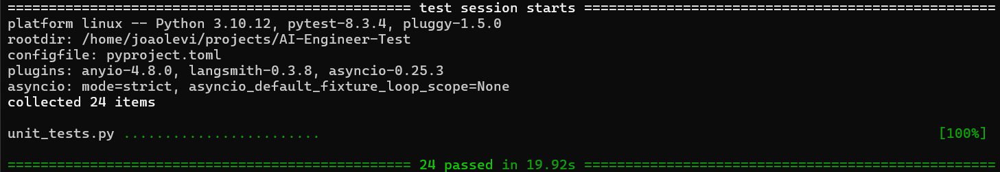

# Desafio para Vaga de Engenheiro de IA

## Descrição

Crie um servidor em Python com um endpoint que recebe uma pergunta e classifica ela em diferentes tipos. O endpoint deve ser capaz de identificar o tipo da pergunta com base no seguinte critério:

- **VEHICLE_COMPATIBILITY**: dúvida de compatibilidade com veículo.
- **PRODUCT_SPECIFICATION**: dúvida sobre a ficha técnica de um produto.
- **SEARCH_PRODUCT**: busca por outro produto.
- **PRICING**: dúvida sobre precificação.
- **UNDEFINED**: caso a pergunta não se encaixe em nenhum dos tipos acima.

### Requisitos

1. O servidor deve aceitar uma requisição **POST** no endpoint **`/chatbot`**.
2. O corpo da requisição deve conter um JSON com a chave **`question`**, que é a pergunta do cliente.
3. O retorno do endpoint deve ser um JSON com a chave **`type`**, contendo a classificação da pergunta.

### Objetivo

A avaliação será focada no **processo de validação das perguntas** e na implementação do código em Python. Além disso, será fornecida uma lista com exemplos de perguntas e as classificações corretas para ajudar na criação do prompt.

Mesmo que não seja possível criar um prompt 100% assertivo, você pode incluir observações sobre possíveis melhorias no processo de validação.

# Resolução do teste by João Lima


## **Visão Geral**

Este projeto é uma API FastAPI para classificar perguntas relacionadas a peças automotivas. Ele utiliza **LangChain** como framework para conectar-se com a API da OpenAI enviando o prompt com a questão do usuário e retornado a classificação correta. O projeto inclui testes unitários automatizados, um ambiente Docker para fácil implantação e integração com o `.env` para configuração.

## **Estrutura do Projeto**

```
AI-Engineer-Test/
├── Dockerfile          # Dockerfile para criação da imagem do container
├── README.md           # Documentação do projeto
├── __pycache__/        # Cache do Python (gerado automaticamente)
├── app/                # Diretório principal do código da aplicação
│   ├── api/            # Módulo da API
│   │   ├── __init__.py
│   │   ├── routers/    # Rotas da API
│   │   │   ├── __init__.py
│   │   │   ├── chatbot.py # Rota principal para classificação de perguntas
│   ├── settings.py     # Configurações globais do projeto
├── data/               # Diretório para armazenar arquivos de dados (se aplicável)
├── main.py             # Ponto de entrada principal da API
├── poetry.lock         # Arquivo de dependências gerado pelo Poetry
├── pyproject.toml      # Configuração do Poetry e dependências do projeto
├── unit_tests.py       # Testes unitários para validar a API
```

## **Instalação e Configuração**

### **Requisitos**

- Python 3.10+
- [Poetry](https://python-poetry.org/)
- Docker (opcional para execução em container)

### **Passos para configuração local**

1. **Clone o repositório:**

   ```sh
   git clone https://github.com/seuusuario/AI-Engineer-Test.git
   cd AI-Engineer-Test
   ```

2. **Instale as dependências com Poetry:**

   ```sh
   poetry install --no-root --no-dev
   ```

3. **Um ****`.env`**** na raiz do projeto já possui algumas configurações pré configuradas, exceto pela API key da OpenAI que você deve adicioná-la.**

   ```sh
   OPENAI_API_KEY=your_api_key_here
   ```

4. **Execute o projeto:**

   ```sh
   poetry run python main.py
   ```

## **Executando com Docker**

O projeto pode ser executado dentro de um container Docker.

### **Construção da Imagem Docker**

```sh
docker build -t ai-engineer-test .
```

### **Executando o Container**

```sh
docker run --env-file .env -p 8000:8000 ai-engineer-test
```

## **Uso da API**

A API está configurada para rodar na porta **8000**. Após iniciar o projeto, você pode acessá-la em:

- **Documentação Interativa:** [http://localhost:8000/chatbot](http://localhost:8000/chatbot)
- **Endpoint Principal:**
  ```sh
  POST /chatbot
  Content-Type: application/json
  {
      "question": "Frasle original na caixa??"
  }
  ```
  **Resposta Esperada:**
  ```json
  {
      "type": "PRODUCT_SPECIFICATIONS"
  }
  ```

## **Testes**

O projeto inclui testes unitários para garantir a classificação correta das perguntas. 

Cada teste unitário foi realizado coletando-se a pergunta do usuário no arquivo `amostrar.xlsx`, enviando através da API para o modelo de LLM e validando o resultado com o campo `type`.

Para rodá-los:

```sh
pytest unit_tests.py
```
Resultado dos testes:



## OpenAI e Prompt

O modelo de LLM utilizado foi o gpt-3.5-turbo que atendeu muito bem as expectativas.

A técnica de engenharia de prompt utilizada primeiramente foi a `zero-short` onde apenas algumas regras foram definidas. Mas o resultado não foi tão bom visto a variade de frases que o usuário pode enviar. 

Por fim, alterei a técnica para `few-short learning` onde eu passo alguns exemplos para que o modelo entenda melhor como classificá-las.

## Pontos de melhoria

Para uma melhor assertividade considerando que a API vá para produção, o melhor seria fornecer mais exemplos para o modelo assim como foi feito no prompt.

Uma outra opção seria utilizar modelos self-hosted como o Llama3 para diminuir o custo com modelos pagos.


